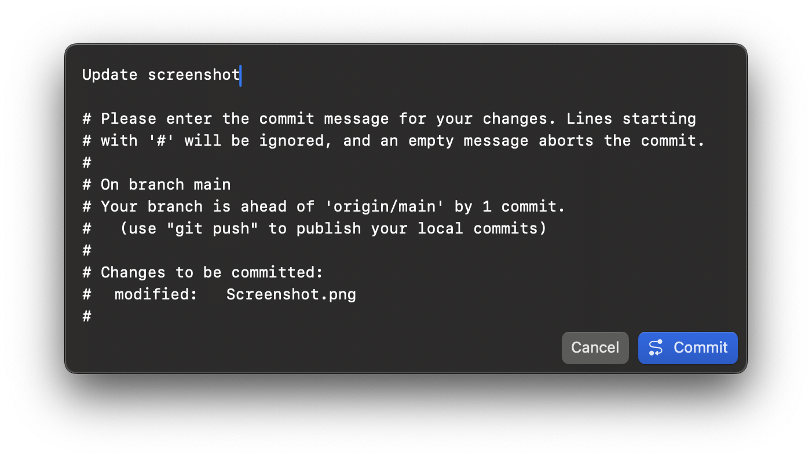

  

  # CommitEdit

  A native macOS commit message editor

  

## Acknowledgements

The pen in the app icon was based on that of [CodeEdit](https://github.com/CodeEditApp/CodeEdit), licensed under MIT.
