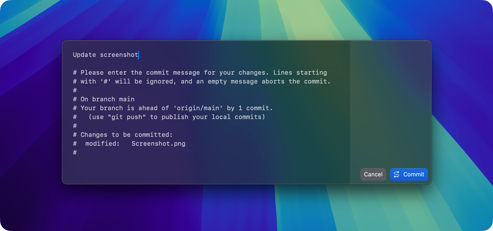

  

  # CommitEdit

  A native macOS commit message editor

  

## Donations

CommitEdit is a free app that I develop in my free time. If you want to support me or want the app available in the App Store, please consider donating! I accept donations through [GitHub Sponsors](https://github.com/sponsors/kra-mo) and [Liberapay](https://liberapay.com/kramo).

Thank you for your generosity! 💙

## Acknowledgements

The pen in the app icon was based on that of [CodeEdit](https://github.com/CodeEditApp/CodeEdit), licensed under MIT.
